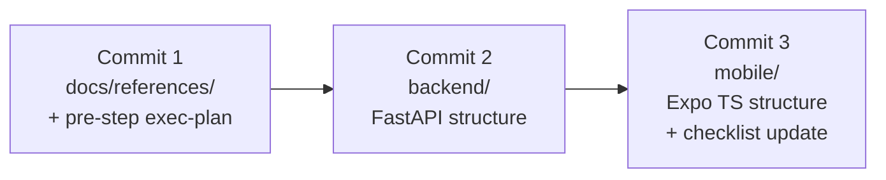

# План: Phase 1 / Track C — структурный скелет

> **Место в общем плане.** Этот документ — детальный exec-plan для **Track C Фазы 1** из главного roadmap'а ([roadmap.md](roadmap.md), раздел 5 → «Фаза 1 / Track C — Технический скелет»). Параллельно идут Track A (продуктовые спеки — закрыт 2026-04-19) и Track B (мокапы — отдельный план).

## Цель

Создать **структурный** скелет двух кодовых проектов — `backend/` (FastAPI) и `mobile/` (Expo + TypeScript) — такой, чтобы:

- архитектура из [ARCHITECTURE.md](../../../ARCHITECTURE.md) и [BACKEND.md](../../BACKEND.md) / [FRONTEND.md](../../FRONTEND.md) была буквально видна в дереве папок;
- любой следующий шаг (hello-world, thin slice, реальные модели) мог встать в готовое место без переноса файлов;
- всё это можно было закоммитить в репозиторий и работать дальше «от готового скелета», а не с нуля.

**Что мы НЕ делаем в этом плане** (важное ограничение скоупа):

- Не делаем рабочий hello-world (`/health` на бэке + дёргание из мобильного на iPhone). Это **следующий** план.
- Не заполняем поля моделей БД — это Phase 2 (thin slice).
- Не подключаем Manrope / Material Symbols. Шрифты — отдельный шаг.
- Не запускаем приложение на iPhone через Expo Go — это часть hello-world.

## Контекст

- Документация под Track C уже зрелая: [docs/stack.md](../../stack.md), [docs/BACKEND.md](../../BACKEND.md), [docs/FRONTEND.md](../../FRONTEND.md), [ARCHITECTURE.md](../../../ARCHITECTURE.md), [docs/references/expo.md](../../references/expo.md).
- Папок `mobile/` и `backend/` ещё нет — это видно по чек-листу A.4 в [mvp-product-spec.md](mvp-product-spec.md), все пункты пустые.
- Локально установлены: Node.js v22, Python 3.13, pip. Дополнительно ставить ничего не нужно.
- Выбранный стек: React Native + Expo (TypeScript) + Python/FastAPI + SQLModel/SQLAlchemy + SQLite (см. [stack.md](../../stack.md), журнал решений за 2026-04-19).

## Принципы выполнения

Соответствуют [core-beliefs.md](../../design-docs/core-beliefs.md):

1. **Документация — система записи** (пункт 1). Сам этот план — артефакт. Все решения по ходу — сюда в «Журнал решений».
2. **Перед использованием библиотеки — Context7** (пункт 5). Справки по библиотекам кладутся в `docs/references/` **до** того, как появится код, который их использует. Поэтому первый коммит — справки.
3. **Boring tech first** (пункт 4). Никаких экзотических менеджеров пакетов, никаких альфа-версий.
4. **Архитектура важнее свободы** (пункт 9). Структура папок строго по [ARCHITECTURE.md](../../../ARCHITECTURE.md) / [BACKEND.md](../../BACKEND.md).
5. **Перед большими изменениями — спрашиваем** (пункт 11). План обсуждён и утверждён владельцем продукта 2026-04-27.

## Поток работы (три коммита)



## Чек-лист

### Pre-step (попадает в Commit 1)
- [x] Создать этот файл `phase1-track-c-skeleton.md`
- [x] Обновить `exec-plans/index.md` — добавить ссылку на этот план

### Commit 1 — справки по библиотекам через MCP `user-context7`

Каждая справка ~60-100 строк по шаблону: **зачем нужна в проекте → версия → ключевое API → подводные камни → ссылка на полную доку**.

**Бэкенд (4 справки):**
- [x] `docs/references/fastapi.md`
- [x] `docs/references/sqlmodel.md`
- [x] `docs/references/pydantic-settings.md`
- [x] `docs/references/uvicorn.md`

**Мобильное (4 справки):**
- [x] `docs/references/expo-router.md`
- [x] `docs/references/i18next.md`
- [x] `docs/references/react-i18next.md`
- [x] `docs/references/expo-localization.md`

- [x] Обновить таблицу в `docs/references/index.md` (8 новых строк)
- [ ] Закоммитить **Commit 1**

### Commit 2 — `backend/` (структура без логики)

Структура соответствует [BACKEND.md](../../BACKEND.md), раздел «Структура проекта». Менеджер пакетов — **pip + venv** (boring default).

- [ ] `backend/pyproject.toml` — декларация зависимостей, Python 3.13
- [ ] `backend/.python-version` — 3.13
- [ ] `backend/.env.example` — шаблон без секретов
- [ ] `backend/README.md` — короткая заглушка «как поднять»
- [ ] `backend/app/__init__.py`
- [ ] `backend/app/main.py` — `app = FastAPI()` без эндпоинтов
- [ ] `backend/app/core/{__init__,config,logging}.py` — заглушки
- [ ] `backend/app/workout/{__init__,routes,service,models}.py` — заглушки
- [ ] `backend/app/exercise_chat/{__init__,routes,service,models}.py` — заглушки
- [ ] `backend/app/video_analysis/{__init__,routes,service,models}.py` — заглушки
- [ ] `backend/app/ai_coach/{__init__,routes,service,models}.py` — заглушки
- [ ] `backend/app/ai_provider/{__init__,base,gemini}.py` — абстракция + заглушка-реализация
- [ ] `backend/app/storage/{__init__,base,local}.py` — абстракция + заглушка-реализация
- [ ] `backend/app/db/__init__.py`, `backend/app/db/session.py` — заглушка `create_engine(...)`
- [ ] `backend/app/db/models/{__init__,exercise,workout,exercise_chat,chat_message,video_analysis}.py` — пустые SQLModel-классы
- [ ] `backend/tests/{__init__.py,conftest.py}` — пусто
- [ ] Закоммитить **Commit 2**

### Commit 3 — `mobile/` (структура без логики)

Генерируем стандартным шаблоном Expo SDK 54 (TypeScript + expo-router):

```bash
npx create-expo-app@latest mobile --template default
```

После генерации — кастомизируем:

- [ ] `mobile/src/theme/{colors,spacing,radius,typography,index}.ts` — Lucent-токены (цвета и базовые отступы; **без загрузки Manrope**)
- [ ] `mobile/src/i18n/index.ts` — `i18next.init` + `expo-localization`
- [ ] `mobile/src/i18n/locales/ru.json` — пустой словарь (или один тестовый ключ)
- [ ] `mobile/src/components/.gitkeep`
- [ ] `mobile/src/api/.gitkeep`
- [ ] `mobile/src/domain/{exercise,workout,chat}.ts` — TS-типы (зеркалят backend-модели; пустые заглушки)
- [ ] `mobile/app/_layout.tsx` — корневой layout, инициализирует i18n
- [ ] `mobile/app/index.tsx` — экран тренировки (заглушка: `View` с заголовком)
- [ ] `mobile/app/chat/[exerciseId].tsx` — экран чата (заглушка)
- [ ] `mobile/.env.example` + `mobile/README.md` (заглушки)
- [ ] Обновить чек-лист A.4 в [mvp-product-spec.md](mvp-product-spec.md): первые два пункта — `[x]`, hello-world и автогенерация схемы БД — оставить `[ ]`
- [ ] Закоммитить **Commit 3**

## Открытые вопросы

- Точные версии библиотек MVP (фиксируем в Commit 1 по последним справкам Context7).
- Стиль написания TypeScript-моделей: `interface` или `type`. Решим на месте при создании `mobile/src/domain/`.

## Журнал решений

| Дата | Решение | Где зафиксировано |
|---|---|---|
| 2026-04-27 | Track C разделён на «структурный скелет» (этот план) и «hello-world» (следующий план). Причина: гигиенический коммит «зафиксировали архитектуру» без возни с физическим запуском на iPhone. | Этот файл, раздел «Цель» / «Что мы НЕ делаем». |
| 2026-04-27 | Три коммита, а не один: справки по либам → бэкенд → мобильное. По core-beliefs пункт 5 — справки идут **до** использования библиотек. | Этот файл, «Поток работы». |
| 2026-04-27 | Менеджер Python-пакетов: **pip + venv** как boring default. `uv` оставляем как возможный безболезненный апгрейд позже. | Этот файл, чек-лист Commit 2. |
| 2026-04-27 | Шаблон Expo: `default` (TypeScript + expo-router) — по рекомендации [docs/references/expo.md](../../references/expo.md). | Этот файл, чек-лист Commit 3. |
| 2026-04-27 | Lucent-токены сейчас переносим только частично: цвета и базовые отступы. Manrope/Material Symbols — отдельный будущий шаг (не блокирует архитектуру). | Этот файл, «Что мы НЕ делаем». |

## Связанные документы

- [roadmap.md](roadmap.md) — главный план верхнего уровня (этот exec-plan — детализация Track C Фазы 1).
- [mvp-product-spec.md](mvp-product-spec.md) — раздел A.4 (продуктовый чек-лист скелета).
- [BACKEND.md](../../BACKEND.md) — структура бэкенда по доменам.
- [FRONTEND.md](../../FRONTEND.md) — стек и библиотеки мобильного.
- [DATABASE.md](../../DATABASE.md) — список сущностей.
- [ARCHITECTURE.md](../../../ARCHITECTURE.md) — слои и домены.
- [references/expo.md](../../references/expo.md) — research-справка по Expo (была первой в `references/`).
