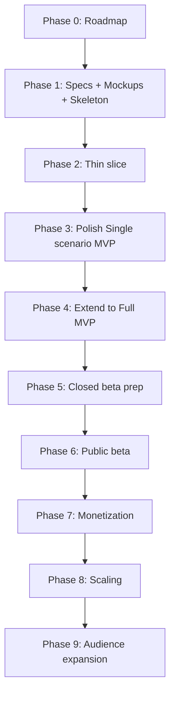

# UPR — roadmap

Top-level plan: phases in order, exit triggers per phase. Detailed exec-plans appear in `docs/exec-plans/active/` at the start of each phase, not earlier.

## 1. Current state (committed)

- Strategy + MVP — `docs/product.md`.
- Product specs (partial): `product-specs/exercise-chat.md`, `videosinstruction.md`, `exercises-base.md` (3 starting exercises), `workout.md` (hardcoded workout).
- Stack — `docs/stack.md`: React + Vite + TypeScript (web) + Python/FastAPI + SQLite (via ORM) + Gemini Free Tier + MediaPipe.
- Architecture — `ARCHITECTURE.md`.
- Operating principles — `docs/design-docs/core-beliefs.md`.
- Lucent design system — `docs/ui/design-system/`.
- `backend/` skeleton — closed 2026-04-27 (`docs/exec-plans/completed/EP-phase1-track-c-skeleton.md`).
- `mobile/` skeleton (React Native + Expo) — frozen 2026-04-27 by frontend pivot (`docs/exec-plans/active/EP-pivot-to-web.md`); files retained on disk, marked in `mobile/README.md`. Active client surface moved to `web/`.
- `web/` skeleton — closed 2026-04-27 (`docs/exec-plans/completed/EP-web-skeleton.md`). Vite + React + TypeScript scaffold, Lucent dark theme, i18next with browser language detection, route shells (`/` Workout, `/chat/:exerciseId` Chat), domain TS types ported from `mobile/`; verified locally on Mac Safari with FastAPI reachable via Vite proxy. Two Lucent gaps inherited from Track B closed in the same plan: `.bottom-sheet` and `.icon-btn` families.

## 2. Two MVP levels

| Term | Meaning | Source |
|---|---|---|
| **Single-scenario MVP** | Narrowest working product: one user scenario end-to-end. Built first. | Section 3 of this file. |
| **Full MVP** | Full MVP package per strategy. | `docs/product.md` → section 9 "Full MVP scope". |

Full MVP is not removed from strategy. Single-scenario MVP is an intermediate stop.

## 3. Single-scenario MVP scope

Single user scenario taken to working state first:

1. Open app — no login / registration / onboarding form.
2. Land on workout screen with three hardcoded exercises.
3. Tap exercise → directly into per-exercise chat. No intermediate exercise screen with technique / set log. Chat = exercise screen. Contains: message area + "Загрузить видео" button + input field.
4. Pick an existing file from gallery via system picker (no in-app camera). Backend → Gemini → analysis appears in same chat.
5. Continue dialogue: follow-up questions, more videos.

### Excluded (deferred)

| Item | Phase |
|---|---|
| In-app camera (capture, permissions) | ≥4 |
| Registration / login / profile | 5 |
| Workout builder | 4 |
| Exercise base 3 → 20 | 4 |
| Set log (weight × reps) | 4 |
| Message retention 2 months / unlimited | 7 |
| Two-stage video quality check | 3 |
| Exercise recognition + chat-match check | 3 |
| Subscription, free/paid limits, billing | 7 |
| Push, floating indicator | 6+ |

## 4. Plan principles

1. **Thin slice first, width later.** One end-to-end scenario must work, even ugly with hardcoded data.
2. **Triggers, not calendar dates.** Each phase has an exit trigger.
3. **Each phase produces docs → commit → next phase.**
4. **No feature in strategy → no feature in code** (`core-beliefs.md`).

## 5. Phases

### Phase 0 — Roadmap fixed ✅

### Phase 1 — Parallel tracks (specs + UI + skeleton)

| Track | Subject | Status |
|---|---|---|
| **A** — Product specs for Single-scenario MVP | 3 exercises + hardcoded workout + single user flow | ✅ Closed 2026-04-19 |
| **B** — UI mockups for Single-scenario MVP | 2 main screens + states, `ui/components.md`, `ui/voice-and-tone.md` | ✅ Closed 2026-04-27 (`completed/EP-track-b-mockups.md`) |
| **C** — `mobile/` + `backend/` skeletons | Folder structure per architecture, no logic | ✅ Closed 2026-04-27 (`completed/EP-phase1-track-c-skeleton.md`); `mobile/` part frozen 2026-04-27 by web pivot |
| **D** — Frontend pivot mobile → web + `web/` skeleton | Doc pivot (`EP-pivot-to-web.md`) → library refs (React, Vite, react-router, i18next, react-i18next, i18next-browser-languagedetector) → Vite + React TS scaffold → Lucent CSS + i18next + route shells → Lucent gap fixes (`.bottom-sheet`, `.icon-btn`) | ✅ Closed 2026-04-27 (`completed/EP-web-skeleton.md`) |

**Exit trigger:** mockups for 2–3 key screens ready ✅, specs closed ✅, `web/` skeleton runs locally on Mac Safari ✅. **Phase 1 fully closed 2026-04-27.**

### Phase 2 — Thin slice (first working Single-scenario MVP)

Goal: Single-scenario MVP runs end-to-end on owner's machine: front → back → AI → back.

- One hardcoded workout, three hardcoded exercises.
- Minimal chat UI, minimal backend endpoint, real Gemini call.
- New refs: `references/gemini.md`, `references/mediapipe.md`.

**Exit trigger:** test video uploaded from owner's Mac Safari (or iPhone Safari via tunnel) yields real Gemini analysis; follow-up question answered.

### Phase 3 — Polish Single-scenario MVP

Polishing only. No scope expansion.

- Full chat with persistent history.
- Two-stage video quality check.
- Exercise recognition + chat-match check.
- Full UI for 2–3 screens per Phase 1 mockups, dark theme via Lucent.
- All system strings via i18next keys.

**Exit trigger:** Single-scenario MVP stable.

### Phase 4 — Extend to Full MVP

Grow product to `docs/product.md` → section 9.

- Exercise base 3 → 20.
- Workout builder.
- Set log (weight × reps).
- Full exercise catalog screen.
- Onboarding / first-experience improvements.

**Exit trigger:** all "Full MVP scope" items implemented.

### Phase 5 — Closed-beta prep (= stack.md Phase 5)

- Sign in with Apple / Google.
- 18+ filter at registration.
- Account deletion + data export.
- Backend deploy (Render / Railway / Fly.io / VPS).
- Video → S3-compatible storage.
- SQLAdmin minimal admin.
- Activate `design-docs/security-future-reference.md` (HTTPS, secure token storage, AI tier with DPA).

**Exit trigger:** 5–20 external users can use the product.

### Phase 6 — Public beta (= stack.md Phase 6)

SQLite → PostgreSQL, task queue (RQ / Celery + Redis), paid AI, observability (Sentry / OpenTelemetry), analytics, full admin panel. Reliability/SLO doc appears. Full `security-future-reference.md` activates.

### Phase 7 — Monetization (= stack.md Phase 7)

Billing (App Store IAP / Google Play / Stripe), limits service, paid tiers, retention policy 2 months / unlimited, AI + live-trainer ladder (`product.md` → section 14).

### Phase 8 — Scaling (= stack.md Phase 8)

Horizontal scaling, Redis cache, CDN, possible dedicated AI worker with GPU, backup AI provider.

### Phase 9 — Audience expansion (= stack.md Phase 9)

English + other locales, live-trainer marketplace, optional native iOS/Android shell (fresh Expo project beside `web/`, requires Apple Developer Account at this point — owner-approved decision).

## 6. Dependency map

## 7. Not planned now

- Live-trainer marketplace — ≥ Phase 9. Ladder first step — Phase 7.
- Native iOS/Android shell — ≥ Phase 9, optional; web is the active client.
- Concrete subscription prices — ≥ Phase 5; tiers active at Phase 7.
- Push, floating indicator — Phase 6+.
- Extended workout metrics (RPE, tempo, rest) — Phase 6+.
- Social features, multi-video comparison — TBD, ≥ Phase 7.
- AI providers other than Gemini — ≥ Phase 6.

## 8. Decision log

| Date | Decision |
|---|---|
| 2026-04-19 | Split **Single-scenario MVP** vs **Full MVP**. Single-scenario MVP first; Full MVP retained, moved to Phase 4. |
| 2026-04-19 | Exercise list → straight into chat. No intermediate exercise screen in Single-scenario MVP. Chat = exercise screen. |
| 2026-04-19 | No in-app camera in Single-scenario MVP — only gallery via system picker. |
| 2026-04-19 | Frontend stack: Flutter → React Native + Expo (TypeScript). Reason: onboarding cost; Expo Go runs on owner's iPhone via QR code, no Xcode/Android Studio. |
| 2026-04-27 | Phase 1 Track C closed — `mobile/` + `backend/` skeletons committed. |
| 2026-04-27 | Documentation refactored to OpenAI Harness Engineering principles: removed premature `RELIABILITY.md`, `PRODUCT_SENSE.md`, `product-specs/product.md` (merged into `docs/product.md`); heavily trimmed `SECURITY.md`, `BACKEND.md`, `DATABASE.md`; full security checklist preserved in `design-docs/security-future-reference.md`. |
| 2026-04-27 | Documentation pass: stripped beginner-oriented narrative and analogies from all `docs/*` files; documentation files are agent-optimized — analogies live in chat output, not in files. |
| 2026-04-27 | **Frontend pivot: React Native + Expo (mobile, iOS via Expo Go) → React + Vite + TypeScript (web).** Cause: owner runs always-on VPN on both Mac and iPhone, blocking LAN reach between Expo Go and FastAPI; Apple Developer Account ($99/year) out of MVP budget; Lucent already authored in HTML/CSS — direct consumption in web. Phase 9 "web build via RN-for-Web" removed; native iOS/Android shell repositioned to optional ≥ Phase 9. New Track D added under Phase 1 to drive `web/` skeleton. `mobile/` skeleton retained on disk as frozen reference. Hello-world plan superseded. Driven by `active/EP-pivot-to-web.md`. |
| 2026-04-27 | **Plans system formalized per OpenAI Harness Engineering.** Added `docs/exec-plans/PLANS.md` (format spec). Renamed all plans to `EP-<slug>.md`. Index rewritten as catalog. AGENTS.md adds Planning workflow + hard rules #10 (ask before AGENTS.md edits) and #11 (plan before non-trivial work). |
| 2026-04-27 | **Phase 1 / Track B closed.** Four HTML mockups (`workout`, `technique-popup`, `chat-empty`, `chat-active`), `voice-and-tone.md`, and `components.md` shipped. Two known gaps deferred to `EP-web-skeleton.md`: bottom-sheet treatment for the technique pop-up (Lucent has none yet — fallback to centered modal) and a token-driven `.icon-btn` Lucent component (mockups inline-style icon buttons). Plan: `completed/EP-track-b-mockups.md`. |
| 2026-04-27 | **Phase 1 / Track D closed — Phase 1 fully closed.** `web/` skeleton runs locally on Mac Safari: Vite + React + TypeScript scaffold, Lucent dark theme + Manrope + Material Symbols Rounded, i18next with browser language detection (Russian-only catalogue), route shells `/` (Workout) + `/chat/:exerciseId` (Chat) with `useTranslation` and `useParams` wiring, domain TS types ported from `mobile/`. FastAPI reachable through Vite proxy (`/api/openapi.json` returns FastAPI JSON 404 with `server: uvicorn` header — proxy verified). Two Lucent gaps inherited from Track B closed inside the same plan: `.bottom-sheet` (with rounded top corners, drag-handle pill, safe-area padding) and `.icon-btn` family (size + intent variants). Plan: `completed/EP-web-skeleton.md`. Project advances to Phase 2 (thin slice). |
