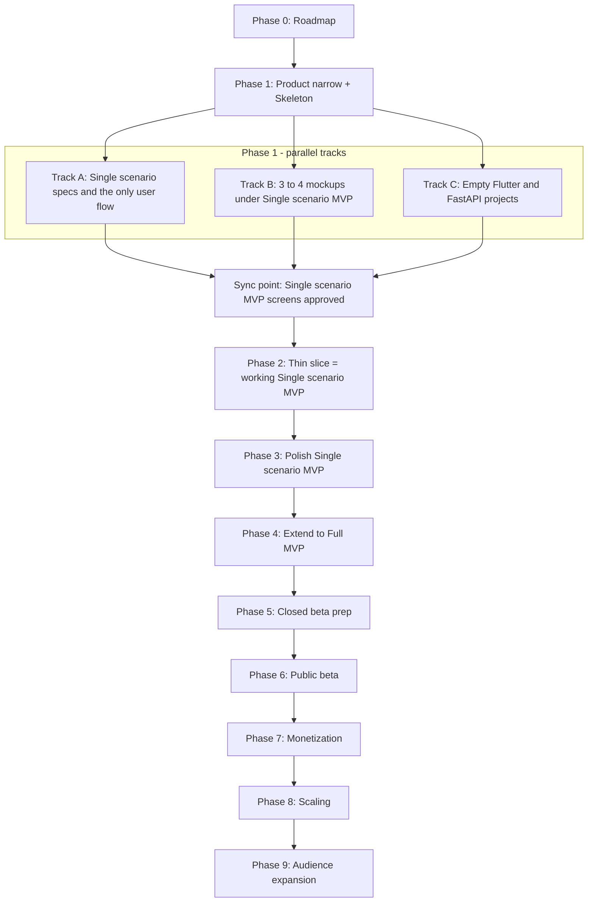

# UPR — Roadmap (главный план верхнего уровня)

Это **карта страны** для всего проекта: какие фазы по порядку, что в каждой фазе делаем, когда переходим дальше. Это **не** детальный чек-лист «какой винт куда крутить» — детальные планы каждой фазы появятся в `docs/exec-plans/active/` **в момент старта** этой фазы, не сейчас.

> **Аналогия.** Roadmap — это план стройки на год, висящий на стене у прораба: «Сначала фундамент, потом стены, потом крыша, потом отделка». Каждый отдельный «чертёж комнаты» (детальный exec-plan) рисуется перед тем, как браться именно за эту комнату.

---

## 1. Цель и форма документа

**Зачем нужен:** иметь единое место, где видно весь путь продукта от текущего состояния до публичного релиза и дальше — на одном экране, без лишних деталей.

**Как пользоваться:**
1. Открой этот файл — увидишь, в какой фазе мы сейчас.
2. Для **деталей текущей фазы** — открой соответствующий exec-plan в `docs/exec-plans/active/`.
3. Для **истории решений** по уже сделанному — смотри журналы решений в exec-plan'ах + `docs/exec-plans/completed/`.

**Чем отличается от детальных exec-plan'ов:**

| Roadmap (этот файл) | Детальный exec-plan |
|---|---|
| Все фазы целиком, до релиза и дальше | Одна фаза или одна крупная задача |
| Без галочек по дням | С галочками `[ ]` / `[x]` |
| Меняется редко | Обновляется в процессе работы |
| Один на проект | Много, по числу задач |

---

## 2. Где мы сейчас (snapshot на 2026-04-19)

**Уже зафиксировано в репозитории:**

- **Стратегия продукта** — `docs/product.md` (approved): тезис, столпы, MVP-пакет, монетизация, риски.
- **Детальная MVP-спека** — `docs/product-specs/product.md` (approved): сущности, главный сценарий, инсайты интервью.
- **Главные продуктовые фичи (частично):** чат с упражнением (`product-specs/exercise-chat.md`), работа с видео (`product-specs/videosinstruction.md`).
- **Технологический стек** — `docs/stack.md` (approved): Flutter + Python/FastAPI + SQLite (через ORM) + Gemini Free Tier + MediaPipe; план масштабирования по этапам.
- **Архитектура** — `ARCHITECTURE.md` (карта доменов и слоёв).
- **Принципы работы (Harness Engineering)** — `docs/design-docs/core-beliefs.md` (approved).
- **Дизайн-система Lucent** — `docs/ui/design-system/` (HTML + CSS как «исходник правды по визуалу», draft).
- **Карта документации для агентов** — `AGENTS.md` / `CLAUDE.md`.

### Два уровня MVP (важное уточнение от 2026-04-19)

Чтобы не путать «**что мы реально доводим до запуска первым**» и «**полный пакет MVP, описанный в стратегии**», вводим два понятия:

| Термин | Что означает | Где описан |
|---|---|---|
| **Single-scenario MVP** | Самый узкий рабочий продукт: один пользовательский сценарий целиком, без всего остального. **Это то, что мы реализуем первым.** | Этот файл, раздел 3 ниже. |
| **Full MVP** | Полный MVP-пакет, как описан в продуктовой стратегии и детальной спеке: каталог 20 упражнений, сборка тренировок, дневник, регистрация, политика хранения и т.д. | `docs/product.md` (раздел 9), `docs/product-specs/product.md` (раздел «Что входит в MVP»). |

> **Важно:** мы **ничего не убираем** из стратегии и из `product-specs/product.md` — Full MVP остаётся целью. Просто между «сейчас» и «Full MVP» добавляется промежуточная остановка — **Single-scenario MVP**, на которой можно проверить главную ценность («снял видео → AI разобрал → продолжаем диалог») без обвеса.

**Ещё открыто (это пойдёт в Фазу 1 — но в сильно урезанном виде, см. раздел 4):**

- Описание содержимого экрана тренировки и трёх стартовых упражнений.
- Описание единственного сценария целиком (упор: загрузка видео + диалог с AI).
- Минимальные UI-мокапы по этому сценарию.
- Кода ещё нет.

---

## 3. Что входит в Single-scenario MVP (узкий первый запуск)

Это **единственный сценарий**, который мы доводим до рабочего состояния в первую очередь:

1. Пользователь открывает приложение — **никакого экрана логина / регистрации / онбординга в виде анкеты**.
2. Сразу попадает на **экран тренировки**, где **уже есть три захардкоженных упражнения** (база + сама тренировка зашиты в код / сид БД).
3. Тыкает на одно из трёх упражнений → **сразу проваливается в чат с этим упражнением**. Никакого промежуточного «экрана упражнения» с описанием техники, дневником подходов и т.п. **нет** — чат и есть экран упражнения. На этом экране: область сообщений + кнопка «загрузить видео» + поле ввода текста.
4. Нажимает «загрузить видео» → выбирает **уже готовый видеофайл из галереи устройства** (системный пикер галереи). **Съёмка видео прямо из приложения в Single-scenario MVP не предусмотрена** — пользователь снимает видео заранее любым удобным способом (стандартная камера телефона), потом приходит в приложение и подгружает файл. Бэкенд принимает → отправляет в Gemini → в этом же чате появляется разбор от AI (текст + при необходимости размеченный кадр).
5. Пользователь может **продолжить диалог** в чате: задать уточняющий вопрос, получить ответ, при желании отправить ещё одно видео в этот же чат.

**Что НЕ входит в Single-scenario MVP** (всё это сохраняется в roadmap и реализуется на следующих фазах):

| Что | Куда переезжает |
|---|---|
| **Съёмка видео внутри приложения** (in-app камера, превью записи, разрешения на камеру) | Не раньше Фазы 4, скорее всего позже. В Single-scenario MVP пользователь снимает видео сторонней камерой и просто подгружает готовый файл. |
| Регистрация / логин / профиль | Фаза 5 (закрытое тестирование). |
| Возможность пользователя **самому добавить упражнения** в тренировку | Фаза 4 (расширение до Full MVP). |
| Расширение базы упражнений с 3 до **20** (как в `product-specs/product.md`) | Фаза 4. |
| **Дневник подходов** (вес × повторения) на экране упражнения | Фаза 4 (по умолчанию). Если решим иначе — фиксируем здесь же. |
| Создание собственных тренировок (workout builder) | Фаза 4. |
| Политика хранения сообщений 2 мес / бессрочно (фоновая задача) | Фаза 3 (полировка). |
| Двухэтапная проверка качества видео (на устройстве + AI) | Фаза 3. |
| Распознавание упражнения и проверка соответствия чату | Фаза 3. |
| Подписки, лимиты free vs paid, оплата | Фаза 7 (монетизация). |
| Удаление аккаунта, экспорт данных | Фаза 5 (приходит вместе с регистрацией). |
| Push-уведомления, плавающий индикатор | Фаза 6 и далее. |

> **Аналогия.** Single-scenario MVP — это **первый прототип лифта в новом доме**: одна шахта, одна кабина, едет с этажа 1 на этаж 3 и обратно. Без выбора этажа кнопками, без музыки, без рекламы внутри. Главное — что лифт **в принципе работает**. Когда работает — добавляем кнопки, музыку, остальные этажи и так далее.

---

## 4. Принципы плана

1. **Сначала thin slice, потом ширина.** Сначала один сквозной сценарий («снял видео → получил разбор от AI → продолжил диалог») должен работать целиком — пусть криво, на захардкоженных данных. Только после этого наращиваем функции вширь. Аналогия: сначала проложи **одну** работающую дорогу через лес, потом расширяй её до шоссе — а не строй полшоссе на каждом из десяти направлений.
2. **Параллельные треки разрешены, но с точками синхронизации.** В Фазе 1 продуктовая часть (спеки + мокапы под Single-scenario MVP) и технический скелет (пустые проекты Flutter/FastAPI) идут одновременно — но в конце фазы синхронизируются: список экранов и сценариев из Track A/B становится входом для Track C.
3. **Триггеры перехода важнее календарных дат.** В каждой фазе зафиксирован **триггер выхода** (что должно быть сделано, чтобы перейти дальше), а не «к 1 июня». Это снимает иллюзию контроля над временем и оставляет контроль над качеством.
4. **Каждая фаза рождает документы → коммит → только потом следующая фаза.** Никаких «решений только в чате». Если что-то решили — оно живёт в `docs/`.
5. **Нет фичи в стратегии — нет фичи в коде.** Любое расширение скоупа проходит через продуктовый документ перед реализацией (см. `docs/design-docs/core-beliefs.md` → принцип 13).
6. **Single-scenario MVP сейчас, Full MVP потом, всё остальное стратегии — ещё позже.** Урезание скоупа Single-scenario MVP **не отменяет** ни одной фичи из `product-specs/product.md` — оно меняет только порядок реализации.

---

## 5. Фазы по порядку

Каждая фаза описана в одной форме: **цель → что делаем → что рождается в `docs/` → триггер выхода в следующую фазу**.

### Фаза 0 — Зафиксировать roadmap

- **Цель:** записать общий план в репозиторий, чтобы дальше работать по нему.
- **Что делаем:** создаём этот файл, обновляем `docs/exec-plans/index.md`, обновляем шапку и чек-лист `docs/exec-plans/active/mvp-product-spec.md` (помечаем его как часть Фазы 1 / Track A и группируем чек-лист на Single-scenario MVP / Post-MVP).
- **Что рождается в `docs/`:** `docs/exec-plans/active/roadmap.md` (этот файл).
- **Триггер выхода:** план закоммичен и согласован.

### Фаза 1 — Параллельно: «продуктовая подготовка под Single-scenario MVP» + «технический скелет»

Центральная фаза перед первым кодом, который что-то реально делает. Внутри фазы — три параллельных трека. **Все три трека работают только под Single-scenario MVP** — ничего лишнего сейчас.

#### Track A — Продукт (узко, под Single-scenario MVP)

| Что делаем | Куда пишем |
|---|---|
| Описание трёх стартовых упражнений (название, краткая техника, картинка/ничего) | `docs/product-specs/exercises-base.md` (раздел «MVP: 3 стартовых упражнения») |
| Описание захардкоженной тренировки (просто список из этих трёх упражнений в фиксированном порядке) | `docs/product-specs/workout.md` (раздел «MVP: единственная захардкоженная тренировка») |
| Главный (и единственный) user flow MVP — детально | `docs/user-flows/upload-video-and-get-feedback.md` |
| Пометить в `mvp-product-spec.md`, что регистрация/логин/онбординг-анкета/добавление упражнений/дневник/подписки → **Post-MVP / Full MVP** | `docs/exec-plans/active/mvp-product-spec.md` (чек-лист переразбит в Фазе 0) |

> **Что НЕ делаем в Track A сейчас:** полные 20 упражнений, workout builder, бизнес-модель, регистрация, удаление аккаунта, подписка. Эти разделы существуют как заглушки в `product-specs/` и наполняются на Фазе 4.

#### Track B — UI / визуал (узко, под Single-scenario MVP)

| Что делаем | Куда пишем |
|---|---|
| Список ключевых UI-компонентов из Lucent под этот сценарий: кнопка, карточка упражнения в списке тренировки, чат-баббл (юзер / AI / системный), кнопка-аттач «загрузить видео», индикатор «AI разбирает», размеченный кадр внутри сообщения | `docs/ui/components.md` |
| Принципы текстов в интерфейсе (как разговариваем с юзером, как пишет AI) | `docs/ui/voice-and-tone.md` |
| Мокапы **2 главных экранов + состояния** Single-scenario MVP: (1) экран тренировки с тремя упражнениями; (2) экран чата с упражнением (область сообщений + кнопка «загрузить видео» + поле ввода). Состояния чата: пустой чат до первого видео, «AI разбирает видео», ответ AI с размеченным кадром, ошибка/нерелевантное видео | `docs/ui/mockups/` |

> **Что НЕ делаем в Track B сейчас:** мокапы экранов регистрации, профиля, каталога 20 упражнений, конструктора тренировок, экранов подписки.

#### Track C — Технический скелет (без продуктовой логики)

| Что делаем | Куда пишем |
|---|---|
| Создать Flutter-проект с правильной структурой папок, i18n через ARB, тёмная тема, перенести **дизайн-токены Lucent** в `ThemeData` | `mobile/` (новая папка в корне) |
| Создать FastAPI-проект со структурой по доменам из `docs/BACKEND.md` (`core/`, `workout/`, `exercise_chat/`, `video_analysis/`, `ai_coach/`, `ai_provider/`, `storage/`, `db/`) | `backend/` (новая папка в корне) |
| Завести `pyproject.toml` / `pubspec.yaml`, поставить «boring»-зависимости. Перед каждой библиотекой — справка через `user-context7` | `docs/references/<library>.md` для каждой библиотеки |
| Базовые ORM-модели, нужные для Single-scenario MVP (формы, без бизнес-логики): Exercise, Workout (захардкоженная), ExerciseChat, ChatMessage, VideoAnalysis. **User пока — захардкоженный синглтон без таблицы.** Subscription / Set — позже. | `backend/app/db/` + `docs/generated/db-schema.md` (автогенерация) |
| Локальный «hello world»: бэк отвечает на `GET /health`, мобильное приложение его дёргает и показывает «ОК» | работает локально |

#### Точка синхронизации Фазы 1

- Track A и B утверждают **финальный список 3-4 экранов и единственный сценарий MVP** → Track C получает понятный вход для Фазы 2.
- Все три трека закоммичены в репозиторий.

#### Триггер выхода Фазы 1

- Мокапы 3–4 ключевых экранов Single-scenario MVP готовы (Track B).
- Описание сценария + трёх упражнений + захардкоженной тренировки закрыто (Track A).
- Технический скелет запускается локально и здоровается (Track C).

### Фаза 2 — Thin slice (вертикальный срез) = первый рабочий Single-scenario MVP

- **Цель:** Single-scenario MVP **в принципе работает** на машине Кристины: фронт → бэк → AI → обратно.
- **Сценарий:** открыть приложение → сразу попасть на экран тренировки → выбрать одно из трёх упражнений → провалиться сразу в чат с этим упражнением → загрузить локальное тестовое видео из чата → бэк примет → отправит в Gemini → в этом же чате появится ответ AI.
- **Что есть:** одна захардкоженная тренировка, три захардкоженных упражнения, минимальный UI чата, минимальный бэк-эндпоинт, реальный вызов Gemini.
- **Чего нет:** регистрации, каталога упражнений, дневника подходов, истории сообщений «по правилам» (хранение 2 мес/бессрочно), валидаций качества видео, красивых ошибок, локализации сверх минимума.
- **Что рождается в `docs/`:** детальный exec-plan этой фазы (`docs/exec-plans/active/<дата>-thin-slice.md`), `docs/references/gemini.md`, `docs/references/mediapipe.md` (через `user-context7`), первая версия `docs/generated/db-schema.md`.
- **Триггер выхода:** на машине Кристины запускается приложение, открывается экран тренировки с тремя упражнениями, отправляется тестовое видео, приходит **реальный** разбор от Gemini, можно задать уточняющий вопрос и получить ответ.

> **Аналогия Фазы 2.** Это как первый раз заварить чай в новой кружке: ты не делаешь сразу чайную церемонию на 12 человек — ты проверяешь, что вода кипятится, кружка не течёт, заварка не разваливается. Когда базовое работает — масштабируешься.

### Фаза 3 — Полировка Single-scenario MVP

Single-scenario MVP уже работает (Фаза 2), но «по краям» он сырой. Здесь шлифуем именно его, **не расширяя скоуп**.

- Полноценный чат: история сообщений сохраняется навсегда (политику 2 мес / бессрочно вводим только когда появятся тарифы — Фаза 7; до этого храним всё).
- Двухэтапная проверка качества видео (на устройстве + AI).
- Распознавание упражнения и проверка соответствия чату (см. `product-specs/videosinstruction.md`).
- Полный UI 3–4 экранов по мокапам Фазы 1, тёмная тема по Lucent.
- Все системные тексты — через ключи перевода (i18n через ARB).
- Документация на использованные библиотеки в `docs/references/`.
- **Триггер выхода:** Single-scenario MVP стабильно работает: видео разбирается, чат с AI ведётся, плохое/нерелевантное видео обрабатывается корректно, всё на русском через i18n.

### Фаза 4 — Расширение до Full MVP

Здесь мы наращиваем продукт до того, что описано в `docs/product-specs/product.md` → раздел «Что входит в MVP».

- База упражнений расширяется с 3 до **20** (`docs/product-specs/exercises-base.md` дозаполняется).
- **Workout builder:** пользователь сам собирает свою тренировку из упражнений базы.
- **Дневник подходов:** вес × повторения на экране упражнения.
- Полноценный экран каталога упражнений.
- Доработка онбординга / первого опыта (по интервью ЦА — без длинной анкеты).
- **Триггер выхода:** все пункты раздела «MVP / Функции» из `docs/product-specs/product.md` реализованы и проходят ручную проверку самой Кристины. Теперь у нас есть **Full MVP**.

### Фаза 5 — Подготовка к закрытому тестированию (= Этап 2 из `docs/stack.md`)

- Простая регистрация (Sign in with Apple / Google — без своих паролей). До этого момента пользователь был один захардкоженный.
- Возрастной фильтр **18+** на регистрации (см. `docs/SECURITY.md`).
- Удаление аккаунта и экспорт данных (приходят вместе с регистрацией).
- Деплой бэка на простой облачный хостинг (Render / Railway / Fly.io / VPS — выбираем отдельной задачей).
- Перенос видео в S3-совместимое хранилище (через ту же абстракцию `storage/`, без переписывания логики).
- Подключение SQLAdmin как минимальной админки.
- Регулярные бэкапы SQLite.
- **Триггер выхода:** 5–20 пользователей могут пользоваться продуктом снаружи.

### Фаза 6 — Публичный бета-релиз (= Этап 3 из `docs/stack.md`)

Переезд SQLite → PostgreSQL (через ту же ORM), очередь задач (RQ / Celery + Redis), переход на платный тариф AI (или сравнение с GPT-4o), observability (Sentry / OpenTelemetry), аналитика продуктовых метрик (PostHog / Amplitude), полноценная админ-панель.

### Фаза 7 — Монетизация (= Этап 4 из `docs/stack.md`)

Биллинг (App Store IAP / Google Play Billing / Stripe), сервис лимитов (rate limiter), платные тарифы, политика хранения сообщений 2 мес / бессрочно (превращение бесплатного и платного уровней в реальные тарифы), лестница «AI + живой тренер» (см. `docs/product.md` → раздел 12).

### Фаза 8 — Масштабирование (= Этап 5 из `docs/stack.md`)

Горизонтальное масштабирование FastAPI, кэширование (Redis), CDN для видео и изображений, возможный переход на выделенный AI-воркер с GPU (open-source vision-LLM), резервный AI-провайдер для отказоустойчивости.

### Фаза 9 — Расширение ЦА (= Этап 6 из `docs/stack.md`)

Английская и другие локали (i18n уже готова), маркетплейс живых тренеров, web-версия (Flutter Web — бонус от выбранного стека).

---

## 6. Карта зависимостей между фазами

Что важно из диаграммы:

- **Только Фаза 1 имеет внутренние параллельные треки.** Все остальные фазы идут последовательно.
- **Точка синхронизации** в конце Фазы 1 — это «ворота» в Фазу 2: пока продуктовые экраны Single-scenario MVP не утверждены, к thin slice не приступаем.
- **Single-scenario MVP** заканчивается в конце Фазы 3, **Full MVP** — в конце Фазы 4.
- **Фазы 5–9 совпадают** с этапами 2–6 из `docs/stack.md` — единая нумерация триггеров масштабирования (просто сдвинуты на +1 относительно прошлой версии плана из-за добавленной Фазы 4).

---

## 7. Что мы НЕ планируем сейчас (вне скоупа этого roadmap'а)

Чтобы план не разрастался и не было соблазна тащить лишнее:

- **Маркетплейс живых тренеров** — стратегически важен (см. `docs/product.md` раздел 12), но как **отдельный продукт внутри продукта** — не раньше Фазы 9. Лестница «AI + живой тренер» в виде первой ступени (приглашение в чат) появляется на Фазе 7.
- **Web-версия** — не раньше Фазы 9, и только если бизнес-модель этого потребует.
- **Конкретные цены подписки и точные лимиты free** — не раньше Фазы 5, когда у нас будут реальные тестовые пользователи; сами тарифы включаются в Фазе 7.
- **Push-уведомления и плавающий индикатор анализа** — Фаза 6+ (см. `docs/product-specs/product.md` → «v2 и далее»).
- **Расширенные метрики тренировки** (RPE, темп, отдых) — Фаза 6+.
- **Социальные фичи и сравнение нескольких видео в одном разборе** — TBD, не раньше Фазы 7.
- **Любые AI-провайдеры кроме Gemini** — только с Фазы 6 (см. `docs/stack.md` → «AI-стратегия»).

---

## 8. Журнал решений по roadmap

| Дата | Решение | Где обсуждалось |
|---|---|---|
| 2026-04-19 | Принят формат: **один master-roadmap-документ + детальные exec-plan'ы по каждой фазе в момент её старта**, не сразу. | Чат, выбор A в вопросе «глубина плана». |
| 2026-04-19 | Принят порядок: **параллельные треки** (продукт + UI + технический скелет) внутри Фазы 1, с точкой синхронизации в конце фазы. | Чат, выбор B в вопросе «очерёдность продукт vs код». |
| 2026-04-19 | Введено разделение **Single-scenario MVP** (один сценарий, без логина, тренировка с 3 захардкоженными упражнениями, фокус на «видео + AI-чат») и **Full MVP** (полный пакет из `product-specs/product.md`). Single-scenario MVP реализуем первым. Full MVP не отменяется — переезжает в новую Фазу 4 («Расширение до Full MVP»). Старые фазы 4–8 сдвинуты в фазы 5–9. | Этот файл, раздел 3. |
| 2026-04-19 | По умолчанию **дневник подходов (вес × повторения)** не входит в Single-scenario MVP — переезжает в Фазу 4. | Уточняющий вопрос в чате; ответ B. |
| 2026-04-19 | Из списка упражнений на экране тренировки **переход сразу в чат** этого упражнения. **Никакого промежуточного «экрана упражнения»** с описанием техники / дневником / отдельной кнопкой загрузки видео — нет. Чат и есть «экран упражнения»; кнопка «загрузить видео» живёт прямо в чате (как аттач). Это сокращает Single-scenario MVP до **двух главных экранов**: экран тренировки и экран чата. Описание техники упражнения — Post-MVP / Фаза 4 (либо как отдельный экран, либо как первое системное сообщение в чате — решим там). | Чат, уточнение от 2026-04-19. |
| 2026-04-19 | В Single-scenario MVP **нет съёмки видео внутри приложения** — только подгрузка уже готового файла из галереи устройства через системный пикер. Это убирает из скоупа: интеграцию с камерой, превью записи, разрешения на камеру, обработку прерываний во время записи. Юзер снимает видео сторонней камерой телефона до прихода в приложение. Возврат in-app съёмки — не раньше Фазы 4. | Чат, уточнение от 2026-04-19. |
| 2026-04-19 | **Track A Фазы 1 закрыт.** Зафиксированы: 3 стартовых упражнения (`romanian_deadlift`, `lat_pulldown_to_chest`, `dumbbell_biceps_curl`) с минимальным набором полей (`id`, `name`, `technique`); единственная захардкоженная тренировка «Вайбкодинговая тренировка» от 19.04.2026 с описанной анатомией экрана и карточки; единственный user flow `upload-video-and-get-feedback.md`; врезки «Single-scenario MVP: что упрощено» добавлены в approved-документы `exercise-chat.md` и `videosinstruction.md`. Чат имеет два состояния (пустой / активный), второе включается после первого ответа AI. Загрузка видео — instant send без промежуточного экрана-превью. Готово к старту Track B (мокапы 2 экранов + поп-ап). | `docs/product-specs/exercises-base.md`, `docs/product-specs/workout.md`, `docs/user-flows/upload-video-and-get-feedback.md`, врезки в `docs/product-specs/exercise-chat.md` и `docs/product-specs/videosinstruction.md`, галочки в `docs/exec-plans/active/mvp-product-spec.md`. |

---

## 9. Связанные документы

| Нужно понять… | Куда смотреть |
|---|---|
| Стратегия продукта | `docs/product.md` |
| Детальный обзор и Full MVP-функции | `docs/product-specs/product.md` |
| Текущий план продуктовой проработки (часть Фазы 1 / Track A) | `mvp-product-spec.md` |
| Технологический стек и план масштабирования | `docs/stack.md` |
| Карта доменов и архитектурные слои | `../../../ARCHITECTURE.md` |
| Бэкенд / фронтенд / БД / безопасность | `docs/BACKEND.md`, `docs/FRONTEND.md`, `docs/DATABASE.md`, `docs/SECURITY.md` |
| Дизайн-система Lucent | `docs/ui/design-system/README.md` |
| Принципы работы (Harness Engineering) | `docs/design-docs/core-beliefs.md` |
| Оглавление всех планов | `../index.md` |
