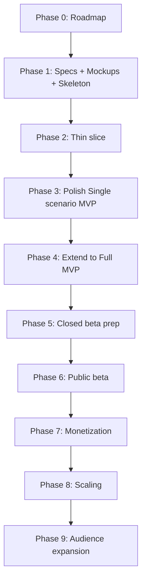

# UPR — Roadmap (главный план верхнего уровня)

Это **карта страны** для всего проекта: какие фазы по порядку и когда переходим дальше. **Не** детальный чек-лист «какой винт куда крутить» — детальные планы каждой фазы появляются в `docs/exec-plans/active/` **в момент старта** этой фазы, не сейчас.

> **Аналогия.** Roadmap — план стройки на год, висящий у прораба: «сначала фундамент, потом стены, потом крыша». Каждый «чертёж комнаты» (детальный exec-plan) рисуется перед тем, как браться именно за неё.

## 1. Где мы сейчас

**Уже зафиксировано в репозитории:**

- **Стратегия и MVP** — `docs/product.md` (единый документ продукта).
- **Главные продуктовые фичи (частично):** `product-specs/exercise-chat.md`, `product-specs/videosinstruction.md`, `product-specs/exercises-base.md` (3 стартовых упражнения), `product-specs/workout.md` (захардкоженная тренировка).
- **Технологический стек** — `docs/stack.md`: React Native + Expo (TypeScript) + Python/FastAPI + SQLite (через ORM) + Gemini Free Tier + MediaPipe.
- **Архитектура** — `ARCHITECTURE.md`.
- **Принципы работы** — `docs/design-docs/core-beliefs.md`.
- **Дизайн-система Lucent** — `docs/ui/design-system/`.
- **Технический скелет проектов `mobile/` и `backend/`** — закрыт 2026-04-27 (см. `docs/exec-plans/completed/2026-04-27-phase1-track-c-skeleton.md`).

## 2. Two MVP уровня (важное уточнение)

Чтобы не путать «**что мы реально доводим до запуска первым**» и «**полный пакет MVP, описанный в стратегии**»:

| Термин | Что означает | Где описан |
|---|---|---|
| **Single-scenario MVP** | Самый узкий рабочий продукт: один пользовательский сценарий целиком, без всего остального. **Это то, что мы реализуем первым.** | Раздел 3 этого файла. |
| **Full MVP** | Полный MVP-пакет, как описан в стратегии. | `docs/product.md` → раздел 9 «Что входит в Full MVP». |

> **Важно:** мы **ничего не убираем** из стратегии. Full MVP остаётся целью. Просто между «сейчас» и «Full MVP» добавляется промежуточная остановка — Single-scenario MVP, на которой можно проверить главную ценность («снял видео → AI разобрал → продолжаем диалог») без обвеса.

## 3. Что входит в Single-scenario MVP

**Единственный сценарий**, который доводим до рабочего состояния первым:

1. Пользователь открывает приложение — **никакого логина / регистрации / онбординг-анкеты**.
2. Сразу попадает на **экран тренировки**, где **уже есть три захардкоженных упражнения**.
3. Тыкает на упражнение → **сразу проваливается в чат с этим упражнением**. Никакого промежуточного экрана упражнения с описанием техники / дневником подходов **нет** — чат и есть «экран упражнения». Внутри: область сообщений + кнопка «загрузить видео» + поле ввода.
4. Жмёт «загрузить видео» → выбирает **уже готовый файл из галереи** (системный пикер). **Съёмки видео внутри приложения нет.** Бэкенд принимает → Gemini → разбор появляется в этом же чате.
5. Можно **продолжить диалог**: уточнить вопрос, отправить следующее видео.

**Что НЕ входит в Single-scenario MVP** (всё это сохраняется в roadmap и реализуется позже):

| Что | Куда переезжает |
|---|---|
| Съёмка видео внутри приложения (in-app камера, разрешения) | Не раньше Фазы 4 |
| Регистрация / логин / профиль | Фаза 5 |
| Workout builder (юзер сам собирает тренировку) | Фаза 4 |
| База упражнений с 3 → 20 | Фаза 4 |
| Дневник подходов (вес × повторения) | Фаза 4 |
| Политика хранения сообщений 2 мес / бессрочно | Фаза 7 |
| Двухэтапная проверка качества видео | Фаза 3 |
| Распознавание упражнения и проверка соответствия чату | Фаза 3 |
| Подписки, лимиты free vs paid, оплата | Фаза 7 |
| Push-уведомления, плавающий индикатор | Фаза 6+ |

> **Аналогия.** Single-scenario MVP — это **первый прототип лифта в новом доме**: одна шахта, одна кабина, едет с этажа 1 на этаж 3. Без выбора этажа кнопками, без музыки. Главное — что лифт **в принципе работает**.

## 4. Принципы плана

1. **Сначала thin slice, потом ширина.** Сначала один сквозной сценарий должен работать целиком — пусть криво, на захардкоженных данных. Только потом наращиваем функции вширь.
2. **Триггеры перехода важнее календарных дат.** В каждой фазе зафиксирован **триггер выхода**, а не «к 1 июня».
3. **Каждая фаза рождает документы → коммит → только потом следующая фаза.** Никаких «решений только в чате».
4. **Нет фичи в стратегии — нет фичи в коде** (см. `core-beliefs.md`).

## 5. Фазы по порядку

### Фаза 0 — Зафиксировать roadmap ✅
Закрыта.

### Фаза 1 — Параллельные треки (продукт + UI + технический скелет)

| Track | Что | Статус |
|---|---|---|
| **A** — Продуктовые спеки под Single-scenario MVP | 3 упражнения + захардкоженная тренировка + единственный user flow | ✅ Закрыт 2026-04-19 |
| **B** — UI-мокапы под Single-scenario MVP | 2 главных экрана + состояния, `ui/components.md`, `ui/voice-and-tone.md` | 🔄 В работе |
| **C** — Технический скелет `mobile/` + `backend/` | Структура папок по архитектуре, без логики | ✅ Закрыт 2026-04-27 (`completed/2026-04-27-phase1-track-c-skeleton.md`) |

**Триггер выхода Фазы 1:** мокапы 2–3 ключевых экранов готовы, спеки закрыты, скелет запускается локально.

### Фаза 2 — Thin slice (первый рабочий Single-scenario MVP)

**Цель:** Single-scenario MVP **в принципе работает** на машине Кристины: фронт → бэк → AI → обратно.

- Одна захардкоженная тренировка, три захардкоженных упражнения.
- Минимальный UI чата, минимальный бэк-эндпоинт, реальный вызов Gemini.
- Появляются справки `references/gemini.md`, `references/mediapipe.md`.

**Триггер выхода:** на iPhone Кристины через Expo Go отправляется тестовое видео и приходит **реальный** разбор от Gemini, можно задать уточняющий вопрос и получить ответ.

### Фаза 3 — Полировка Single-scenario MVP

Single-scenario MVP уже работает, но «по краям» сырой. Шлифуем именно его, **не расширяя скоуп**.

- Полноценный чат с сохранением истории.
- Двухэтапная проверка качества видео.
- Распознавание упражнения и проверка соответствия чату.
- Полный UI 2–3 экранов по мокапам Фазы 1, тёмная тема по Lucent.
- Все системные тексты — через ключи перевода (i18next).

**Триггер выхода:** Single-scenario MVP стабильно работает.

### Фаза 4 — Расширение до Full MVP

Наращиваем продукт до того, что описано в `docs/product.md` → раздел 9.

- База упражнений 3 → **20**.
- **Workout builder** (юзер сам собирает тренировку).
- **Дневник подходов** (вес × повторения).
- Полноценный экран каталога упражнений.
- Доработка онбординга / первого опыта.

**Триггер выхода:** все пункты раздела «Что входит в Full MVP» из `docs/product.md` реализованы. Теперь у нас есть **Full MVP**.

### Фаза 5 — Подготовка к закрытому тестированию (= Этап 2 из `stack.md`)

- Простая регистрация (Sign in with Apple / Google).
- Возрастной фильтр **18+** на регистрации.
- Удаление аккаунта и экспорт данных.
- Деплой бэка (Render / Railway / Fly.io / VPS).
- Видео в S3-совместимое хранилище.
- SQLAdmin как минимальная админка.
- Подключение чек-листа `design-docs/security-future-reference.md` (HTTPS, безопасное хранилище токенов, перевод видео на тариф AI с DPA).

**Триггер выхода:** 5–20 пользователей могут пользоваться продуктом снаружи.

### Фаза 6 — Публичный бета-релиз (= Этап 3 из `stack.md`)

SQLite → PostgreSQL, очередь задач (RQ / Celery + Redis), платный AI, observability (Sentry / OpenTelemetry), аналитика, полноценная админ-панель. На этой фазе появляется **отдельный документ Reliability/SLO** и активируется весь `security-future-reference.md`.

### Фаза 7 — Монетизация (= Этап 4 из `stack.md`)

Биллинг (App Store IAP / Google Play / Stripe), сервис лимитов, платные тарифы, политика хранения сообщений 2 мес / бессрочно, лестница «AI + живой тренер» (см. `product.md` → раздел 14).

### Фаза 8 — Масштабирование (= Этап 5 из `stack.md`)

Горизонтальное масштабирование, кэш (Redis), CDN, возможный переход на выделенный AI-воркер с GPU, резервный AI-провайдер.

### Фаза 9 — Расширение ЦА (= Этап 6 из `stack.md`)

Английская и другие локали, маркетплейс живых тренеров, web-версия (React Native for Web).

## 6. Карта зависимостей

## 7. Что мы НЕ планируем сейчас

- **Маркетплейс живых тренеров** — не раньше Фазы 9. Лестница «AI + живой тренер» (первая ступень) — Фаза 7.
- **Web-версия** — не раньше Фазы 9.
- **Конкретные цены подписки** — не раньше Фазы 5; тарифы включаются в Фазе 7.
- **Push-уведомления, плавающий индикатор** — Фаза 6+.
- **Расширенные метрики тренировки** (RPE, темп, отдых) — Фаза 6+.
- **Соцфичи и сравнение нескольких видео** — TBD, не раньше Фазы 7.
- **Любые AI-провайдеры кроме Gemini** — только с Фазы 6.

## 8. Журнал ключевых решений

| Дата | Решение |
|---|---|
| 2026-04-19 | Введено разделение **Single-scenario MVP** и **Full MVP**. Single-scenario MVP реализуем первым; Full MVP не отменяется, переезжает в Фазу 4. |
| 2026-04-19 | Из списка упражнений **переход сразу в чат**. Никакого промежуточного «экрана упражнения» в Single-scenario MVP. Чат и есть экран упражнения. |
| 2026-04-19 | В Single-scenario MVP **нет съёмки видео внутри приложения** — только подгрузка из галереи через системный пикер. |
| 2026-04-19 | **Frontend-стек: Flutter → React Native + Expo (TypeScript).** Причина — порог входа: Expo Go даёт разработку на iPhone владельца через QR-код, без Xcode/Android Studio. |
| 2026-04-27 | **Track C Фазы 1 закрыт** — структурный скелет `mobile/` + `backend/` коммит-нут. |
| 2026-04-27 | **Документация оптимизирована** под принципы статьи OpenAI Harness Engineering: убраны преждевременные `RELIABILITY.md`, `PRODUCT_SENSE.md`, `product-specs/product.md` (объединено в `docs/product.md`); сильно сокращены `SECURITY.md`, `BACKEND.md`, `DATABASE.md`; полный security-чек-лист сохранён в `design-docs/security-future-reference.md`. |

## 9. Связанные документы

| Нужно понять… | Куда смотреть |
|---|---|
| Продукт целиком (стратегия + MVP + принципы) | `docs/product.md` |
| Технологический стек и план масштабирования | `docs/stack.md` |
| Карта доменов и архитектурные слои | `../../../ARCHITECTURE.md` |
| Бэкенд / фронтенд / БД / безопасность | `docs/BACKEND.md`, `docs/FRONTEND.md`, `docs/DATABASE.md`, `docs/SECURITY.md` |
| Дизайн-система Lucent | `docs/ui/design-system/README.md` |
| Принципы работы (Harness Engineering) | `docs/design-docs/core-beliefs.md` |
| Текущий план продуктовой проработки | `mvp-product-spec.md` |
| Оглавление всех планов | `../index.md` |
