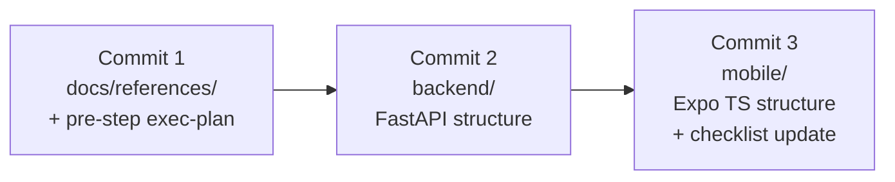

# Plan: Phase 1 / Track C — structural skeleton (CLOSED 2026-04-27)

Detailed exec-plan for Track C of Phase 1 (`../active/roadmap.md` § 5). Track A (product specs) closed 2026-04-19; Track B (mockups) — separate plan.

Closed 2026-04-27 — three commits done (library refs, `backend/` skeleton, `mobile/` skeleton).

## Goal

Structural skeleton of two code projects — `backend/` (FastAPI) and `mobile/` (Expo + TypeScript) — such that:

- architecture from `ARCHITECTURE.md`, `BACKEND.md`, `FRONTEND.md` is visible in folder tree;
- next step (hello-world, thin slice, real models) lands in prepared place without file moves;
- everything committable as "fixed skeleton" baseline.

### Out of scope

- Working hello-world (`/health` on backend + call from mobile on iPhone) — next plan.
- DB model fields — Phase 2 (thin slice).
- Manrope / Material Symbols — separate step.
- Running app on iPhone via Expo Go — part of hello-world.

## Context

- Track C documentation ready: `docs/stack.md`, `docs/BACKEND.md`, `docs/FRONTEND.md`, `ARCHITECTURE.md`, `docs/references/expo.md`.
- `mobile/` and `backend/` did not exist (per A.4 in `EP-mvp-product-spec.md`).
- Local: Node.js v22, Python 3.13, pip.
- Stack: React Native + Expo (TypeScript) + Python/FastAPI + SQLModel/SQLAlchemy + SQLite (`stack.md`, decision log 2026-04-19).

## Execution principles

Per `core-beliefs.md`:

1. Repository = system of record. This plan is the artefact; in-flight decisions go to "Decision log".
2. Library research via `user-context7` before code → first commit = library refs.
3. Boring tech first.
4. Folder structure strictly per `ARCHITECTURE.md` / `BACKEND.md`.
5. Owner approval before structural change — granted 2026-04-27.

## Workflow (3 commits)



## Checklist

### Pre-step (Commit 1)
- [x] Create `phase1-track-c-skeleton.md`
- [x] Update `exec-plans/index.md` — link to this plan

### Commit 1 — library refs via MCP `user-context7`

Each ref ~60–100 lines: purpose in project → version → key API → gotchas → source link.

**Backend (4):**
- [x] `docs/references/fastapi.md`
- [x] `docs/references/sqlmodel.md`
- [x] `docs/references/pydantic-settings.md`
- [x] `docs/references/uvicorn.md`

**Mobile (4):**
- [x] `docs/references/expo-router.md`
- [x] `docs/references/i18next.md`
- [x] `docs/references/react-i18next.md`
- [x] `docs/references/expo-localization.md`

- [x] Update `docs/references/index.md` table (8 rows)
- [x] Commit 1

### Commit 2 — `backend/` (structure, no logic)

Per `BACKEND.md` "Project structure". Package manager: pip + venv.

- [x] `backend/pyproject.toml` — declared deps, Python 3.13
- [x] `backend/.python-version` — 3.13
- [x] `backend/.env.example` — template, no secrets
- [x] `backend/README.md`
- [x] `backend/app/__init__.py`
- [x] `backend/app/main.py` — `app = FastAPI()`, no endpoints
- [x] `backend/app/core/{__init__,config,logging}.py` — stubs
- [x] `backend/app/workout/{__init__,routes,service,models}.py` — stubs
- [x] `backend/app/exercise_chat/{__init__,routes,service,models}.py` — stubs
- [x] `backend/app/video_analysis/{__init__,routes,service,models}.py` — stubs
- [x] `backend/app/ai_coach/{__init__,routes,service,models}.py` — stubs
- [x] `backend/app/ai_provider/{__init__,base,gemini}.py` — abstraction + stub impl
- [x] `backend/app/storage/{__init__,base,local}.py` — abstraction + stub impl
- [x] `backend/app/db/__init__.py`, `backend/app/db/session.py` — `create_engine(...)` stub
- [x] `backend/app/db/models/{__init__,exercise,workout,exercise_chat,chat_message,video_analysis}.py` — empty SQLModel classes
- [x] `backend/tests/{__init__.py,conftest.py}` — empty
- [x] Commit 2

### Commit 3 — `mobile/` (structure, no logic)

Generated via Expo SDK 54 default template (TypeScript + expo-router):

```bash
npx create-expo-app@latest mobile --template default
```

Customizations:

- [x] `mobile/src/theme/{colors,spacing,radius,typography,index}.ts` — Lucent tokens (colors + basic spacing; no Manrope load)
- [x] `mobile/src/i18n/index.ts` — `i18next.init` + `expo-localization`
- [x] `mobile/src/i18n/locales/ru.json` — empty dict (`common: {}`)
- [x] `mobile/src/components/.gitkeep`
- [x] `mobile/src/api/.gitkeep`
- [x] `mobile/src/domain/{exercise,workout,chat}.ts` — TS types mirroring backend models (empty stubs)
- [x] `mobile/app/_layout.tsx` — root layout, i18n init
- [x] `mobile/app/index.tsx` — workout screen stub (`View` + title)
- [x] `mobile/app/chat/[exerciseId].tsx` — chat screen stub
- [x] `mobile/.env.example` + `mobile/README.md` (stubs)
- [x] Update `EP-mvp-product-spec.md` A.4: structure → `[x]`; hello-world + DB schema autogen → `[ ]`
- [x] Commit 3

## Open questions

- Exact MVP library versions (pinned in Commit 1 per latest Context7).
- TypeScript model style: `interface` vs `type` — decided when creating `mobile/src/domain/`.

## Decision log

| Date | Decision | Source |
|---|---|---|
| 2026-04-27 | Track C split into "structural skeleton" (this plan) and "hello-world" (next plan). Reason: clean "architecture fixed" commit without iPhone-launch friction. | "Goal" / "Out of scope" sections. |
| 2026-04-27 | Three commits not one: refs → backend → mobile. Per core-beliefs §4 — refs precede library use. | "Workflow". |
| 2026-04-27 | Python package manager: pip + venv (boring default). `uv` reserved as future upgrade. | Commit 2 checklist. |
| 2026-04-27 | Expo template: `default` (TypeScript + expo-router) per `docs/references/expo.md`. | Commit 3 checklist. |
| 2026-04-27 | Lucent tokens partial transfer: colors + base spacing only. Manrope / Material Symbols — separate step. | "Out of scope". |
