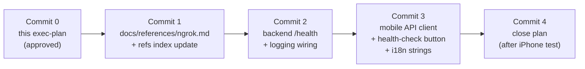

# Plan: Hello-world (closing item of Phase 1 / Track C) — SUPERSEDED 2026-04-27

> **Superseded by `../active/EP-pivot-to-web.md`.**
>
> This plan targeted React Native + Expo on iPhone. After 2026-04-27 frontend pivot to web, the goal "prove backend ↔ frontend wiring" is reassigned to a future `2026-04-27-web-hello-world.md` plan. Backend `/health` content drafted here remains reusable. Mobile-side commits and ngrok integration are no longer planned.
>
> Kept as historical record of:
> 1. The original mobile-via-ngrok connection design.
> 2. The owner's VPN constraints that triggered the pivot.
> 3. Reusable `/health` endpoint design and `__DEV__`-gated debug button pattern.

---

Detailed exec-plan for the last unchecked item of `EP-mvp-product-spec.md` § A.4 — "Local hello world: backend serves `/health`, mobile app calls it." Bridge between Phase 1 (skeletons) and Phase 2 (thin slice with Gemini). Track C split decision recorded 2026-04-27 in `../completed/EP-phase1-track-c-skeleton.md` decision log.

## Goal

End-to-end smoke test: FastAPI backend on owner's mac serves `GET /health`; Expo Go app on owner's iPhone calls it and renders the response. Proves the wiring of FastAPI + Expo + i18n + theme + cross-device transport before any product feature is added.

## Out of scope

- Real product behavior (workout, chat, video, AI). All deferred to Phase 2 thin slice.
- DB persistence (`SQLModel.metadata.create_all`, real models). Deferred to Phase 2.
- `@tanstack/react-query`. Listed in `FRONTEND.md` library table; deferred until multi-endpoint usage in Phase 2 (boring tech first — no premature deps).
- Manrope / Material Symbols. Separate step.
- Production CORS / auth headers / rate limiting. Phase 5+.
- Health-check button in production UI. Removed in Phase 3 polish (logged in `tech-debt-tracker.md` at end of this plan).

## Context

Owner local environment:

- Mac with VPN constantly on (consumer privacy VPN, e.g. NordVPN-class).
- iPhone with VPN constantly on, paired with same Mac via Expo Go for the dev cycle.
- VPN cannot be disabled for development sessions (privacy / region requirements).
- Python 3.13, Node v22, pip — all installed during Track C.

Skeleton state (post-Track C):

- `backend/app/main.py` — `app = FastAPI(...)`, no routes, no logging, no settings wiring.
- `backend/app/core/config.py` — `Settings(BaseSettings)` with `model_config` only, no fields.
- `backend/app/core/logging.py` — `setup_logging()` no-op stub.
- `mobile/app/index.tsx` — static workout-screen stub.
- `mobile/src/api/` — empty (`.gitkeep` only).
- `mobile/src/i18n/locales/ru.json` — `{ "common": {} }`.
- `mobile/.env.example` — `EXPO_PUBLIC_API_BASE_URL=http://localhost:8000` (placeholder).

## Connection method: ngrok

Decision: route iPhone → backend through ngrok HTTP tunnel. Justified by VPN setup (see "Context") — both devices are on consumer privacy VPNs, so direct LAN reach (`192.168.x.x`) is unreliable: incoming local-network connections are typically blocked by mac VPN, and outbound from iPhone goes through its VPN tunnel which cannot resolve private addresses on mac's LAN. ngrok works because both endpoints make **outbound** connections to ngrok's public infrastructure — VPN-friendly by design.

Trade-offs accepted:

- Third-party dependency on ngrok.com (free tier; signup + authtoken required).
- Ephemeral public URL per session (changes on each `ngrok http 8000` restart) — `EXPO_PUBLIC_API_BASE_URL` in `mobile/.env` updated on each session.
- ~100–300 ms added latency. Acceptable for `/health`. Re-evaluated in Phase 2 when video uploads land (size, rate limits).
- Per `core-beliefs.md` § 4: ngrok ref-doc must precede first use → Commit 1 below.

Migration path: when backend is deployed (Phase 5 closed-beta prep), `EXPO_PUBLIC_API_BASE_URL` swaps to a stable hosted URL. ngrok dropped without code change.

## Workflow (4 commits)

## Checklist (frozen at supersession)

### Commit 0 — exec-plan (this file)

- [x] Create `docs/exec-plans/active/EP-hello-world.md` (this file; originally created as `2026-04-27-hello-world.md`, renamed 2026-04-27 under `EP-` scheme)
- [ ] Update `docs/exec-plans/index.md` — add this plan under "Active"
- [ ] Owner approves plan
- [ ] Commit 0

### Commit 1 — `docs/references/ngrok.md`

Per `core-beliefs.md` § 4: ref before use.

- [ ] Fetch ngrok docs via MCP `user-context7` (CLI usage, free-tier limits, authtoken setup, `ngrok http <port>` semantics, URL ephemerality, basic-auth flag for adding password to dev tunnel)
- [ ] Write `docs/references/ngrok.md` (~80–120 lines): purpose in project, version (latest stable), install command (`brew install ngrok/ngrok/ngrok`), one-time auth (`ngrok config add-authtoken ...`), launch command, gotchas (URL changes per session, free-tier 1 simultaneous tunnel, region selection), source link
- [ ] Update `docs/references/index.md` table (+1 row, status `approved`)
- [ ] Commit 1

### Commit 2 — backend `/health` + logging

Architecture: `/health` is cross-cutting infra (not a product domain) → lives in `backend/app/core/`. Per `BACKEND.md` § "Architectural rules" point 1: domain folders are `workout/`, `exercise_chat/`, `video_analysis/`, `ai_coach/`. Cross-cutting → `core/`, `db/`, `ai_provider/`, `storage/`. Health probe = cross-cutting → `core/`.

- [ ] `backend/app/core/health.py` — new file. `router = APIRouter(tags=["health"])`. Single endpoint `GET /health` returning JSON: `{"status": "ok", "service": "upr-backend", "version": <from app.__version__ or hardcoded>}`. No auth, no DB. Russian docstrings explaining purpose.
- [ ] `backend/app/core/config.py` — add `log_level: str = "info"` field. Wired to `UPR_LOG_LEVEL` (env_prefix `UPR_` already set).
- [ ] `backend/app/core/logging.py` — replace no-op with minimal `logging.basicConfig(level=settings.log_level.upper(), format=...)`. Stdlib only — no structlog yet (boring tech first; observability stack is Phase 6 per `stack.md`).
- [ ] `backend/app/main.py` — call `setup_logging()` before `FastAPI()` instantiation. `app.include_router(health.router)`. Update module docstring (no longer "no endpoints").
- [ ] `backend/README.md` — replace section "Local launch (future hello-world)" with "Local launch": full venv + install + uvicorn sequence, plus `curl http://localhost:8000/health` smoke test. Add new section "Expose to iPhone via ngrok" with ngrok install + authtoken + `ngrok http 8000` steps and explanation that printed URL goes into `mobile/.env`.
- [ ] Manual verification on owner's mac: `curl http://localhost:8000/health` → `{"status":"ok",...}`. Logs show `INFO:     127.0.0.1:... "GET /health HTTP/1.1" 200 OK`.
- [ ] Commit 2

### Commit 3 — mobile health-check button

Architecture: HTTP client lives in `mobile/src/api/` (per `FRONTEND.md` § "Project structure"). Screens consume via thin functions, no `fetch` in components.

- [ ] `mobile/src/api/client.ts` — new file. `getApiBaseUrl()` reads `process.env.EXPO_PUBLIC_API_BASE_URL`, throws descriptive error if unset. `apiFetch<T>(path, init?): Promise<T>` — wraps native `fetch`, sets `Content-Type: application/json`, throws `ApiError` (custom class) with status + message on non-2xx, parses JSON on success. No retry / no caching / no react-query — minimal.
- [ ] `mobile/src/api/health.ts` — new file. `export type HealthResponse = { status: string; service: string; version: string }`. `export async function fetchHealth(): Promise<HealthResponse>` calls `apiFetch<HealthResponse>('/health')`.
- [ ] `mobile/src/i18n/locales/ru.json` — add namespace `health` with keys: `button` ("Проверить связь с сервером"), `idle` ("Нажми, чтобы проверить"), `loading` ("Проверяю…"), `ok` ("Сервер ответил: {{status}}"), `error` ("Ошибка: {{message}}"). Keep `common: {}` as-is.
- [ ] `mobile/src/i18n/index.ts` — extend `resources` to register `health` namespace alongside `common`. Update `ns: ['common', 'health']`.
- [ ] `mobile/src/i18n/locales/en.json` — already exists; add mirrored `health` namespace (English strings) so language detection on EN-locale device doesn't crash.
- [ ] `mobile/app/index.tsx` — add: `useState` for `{ kind: 'idle' | 'loading' | 'ok' | 'error', ... }`; `Pressable` button styled per `theme` (accent bg, rounded); status text under button; on press → `fetchHealth()`. All strings via `useTranslation('health')`. Use `colors.semantic.*`, `spacing.*`, `radius.*`, `typography.*` — no hardcoded values.
- [ ] `mobile/.env.example` — replace placeholder line with comment block explaining ngrok flow: each session paste current `https://<random>.ngrok-free.app` URL here. Keep variable name `EXPO_PUBLIC_API_BASE_URL`.
- [ ] `mobile/README.md` — add section "Local launch with iPhone (Expo Go + ngrok)": full sequence (start backend → start ngrok → copy URL into `.env` → restart `npx expo start --clear` → scan QR on iPhone → tap health-check button on Workout screen → expect "Сервер ответил: ok"). Mention ngrok ref `../docs/references/ngrok.md`.
- [ ] Owner manually performs the launch sequence above on her hardware. Expected outcome: green "Сервер ответил: ok" on iPhone screen.
- [ ] Commit 3

### Commit 4 — close plan

Triggered only after owner reports successful iPhone test.

- [ ] `docs/exec-plans/active/EP-mvp-product-spec.md` — A.4 line "Local hello world" → `[x]`; bump `last_updated`
- [ ] `docs/exec-plans/active/roadmap.md` § 1 "Current state (committed)" — add bullet "Hello-world (mac → ngrok → iPhone) — closed YYYY-MM-DD (`../completed/EP-hello-world.md`)"; bump `last_updated`
- [ ] `docs/exec-plans/tech-debt-tracker.md` — add entry: "[YYYY-MM-DD] Dev-only health-check button on Workout screen. **Where:** `mobile/app/index.tsx`. **What:** debug button + status text in production-bound screen. **Why:** smoke test for hello-world / Phase 2. **Plan:** remove in Phase 3 polish (`roadmap.md` § 5). **Priority:** low. **Linked:** this plan."
- [ ] This file (`EP-hello-world.md`) — `status: completed`; move to `docs/exec-plans/completed/`
- [ ] `docs/exec-plans/index.md` — move entry from "Active" to "Completed"
- [ ] Commit 4

## Open questions (frozen at supersession)

- Does owner already have an ngrok account / authtoken, or signup is part of the work? (Affects whether Commit 1 README step says "register at ngrok.com" or "use existing token".)
- Health endpoint response shape: include git SHA / build timestamp for traceability, or keep minimal `{status, service, version}`? Recommendation: minimal now; revisit at Phase 6 (observability).
- ngrok free tier requires region pick (`us`, `eu`, `ap`, …). Default `us` adds RTT for EU users. Recommendation: pin to `eu` in launch command if owner is in EU, else default. Confirmed at Commit 1.
- Should health-check button be visible only in `__DEV__` mode (`if (__DEV__) { ... }`)? Recommendation: yes — guarantees it disappears in any future production build automatically. Implemented in Commit 3.

## Decision log

| Date | Decision | Source |
|---|---|---|
| 2026-04-27 | Connection method = ngrok HTTP tunnel. Reason: VPN on both mac and iPhone, can't be disabled, blocks LAN reachability. ngrok's outbound-only model is VPN-friendly. | "Connection method" section. |
| 2026-04-27 | `/health` lives in `backend/app/core/health.py`, not in any product domain. Reason: cross-cutting infra per `BACKEND.md` § "Architectural rules" point 1. | "Commit 2" subsection. |
| 2026-04-27 | No `@tanstack/react-query` at hello-world stage. Reason: single endpoint, no caching needs, "boring tech first" / "no premature deps" (`core-beliefs.md` § 3). Adopted in Phase 2 thin slice when multiple endpoints land. | "Out of scope". |
| 2026-04-27 | No CORS middleware on backend at hello-world. Reason: React Native fetch doesn't enforce CORS on native; ngrok tunnel exposes backend over HTTPS to public anyway. Real CORS appears with web build (≥ Phase 9) or with a browser-based admin UI. | "Out of scope". |
| 2026-04-27 | Logging stays on stdlib `logging.basicConfig` at this stage. Reason: structured logs / structlog are tied to observability stack (Phase 6 per `stack.md`); premature now. | "Commit 2" subsection. |
| 2026-04-27 | Health-check button gated by `__DEV__` flag in mobile. Reason: guarantees auto-removal from any future release build, complementing the tech-debt-tracker entry. | "Open questions" → answered. |
| 2026-04-27 | Plan = exec-plan-first workflow (`plan_then_code` chosen 2026-04-27 chat). | Owner choice. |
| 2026-04-27 | **SUPERSEDED.** Frontend pivot to web makes mobile-via-ngrok connection design obsolete. Backend `/health` design and `__DEV__`-gated debug button pattern remain reusable for the future `EP-web-hello-world.md` plan. See `../active/EP-pivot-to-web.md`. | Pivot plan. |

## Related documents

| Path | Role |
|---|---|
| `../active/EP-pivot-to-web.md` | **Supersedes this plan.** |
| `../active/roadmap.md` | Top-level roadmap; § 1 was to be updated at Commit 4. |
| `../active/EP-mvp-product-spec.md` | A.4 checkbox was to be flipped at Commit 4. Retargeted to web hello-world. |
| `../completed/EP-phase1-track-c-skeleton.md` | Predecessor plan; "next plan" reference (mobile skeleton, now frozen). |
| `../tech-debt-tracker.md` | Health-check button removal entry was to be added at Commit 4 (n/a now). |
| `../../references/ngrok.md` | New ref planned at Commit 1; not written; ngrok no longer mandatory. |
| `../../references/index.md` | Was to be updated at Commit 1. |
| `../../BACKEND.md` | Architecture constraints honored at Commit 2 (still valid for web hello-world). |
| `../../FRONTEND.md` | Rewritten 2026-04-27 for web stack. |
